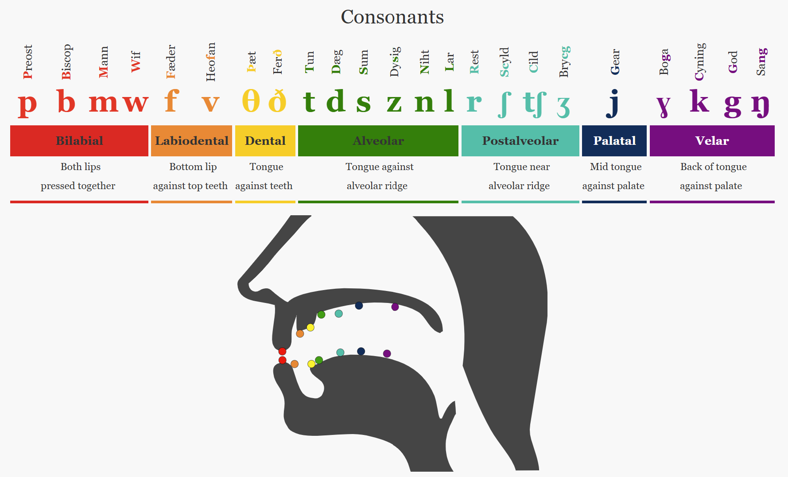
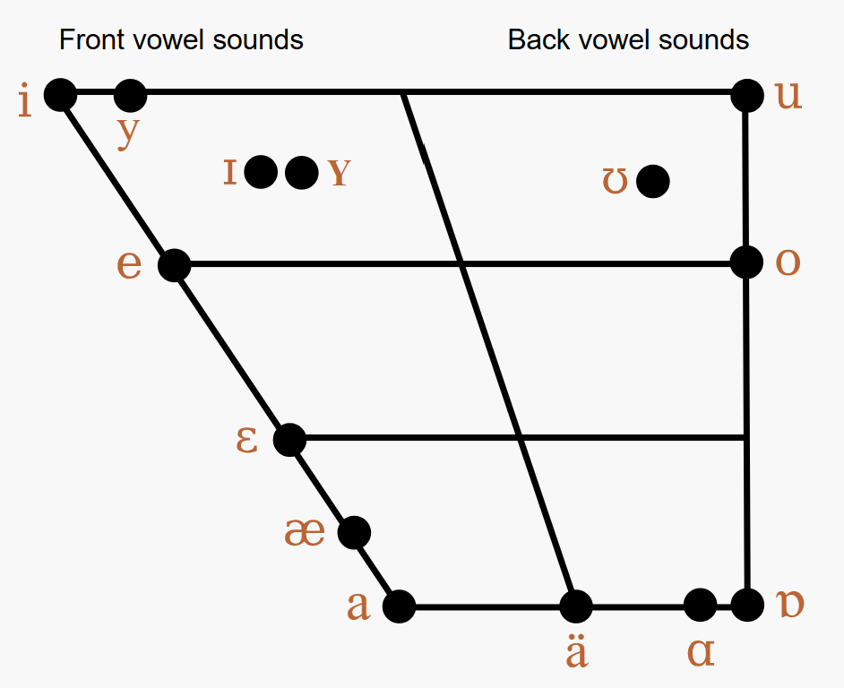

# Introduction

The sounds of Old English should not prove difficult, with a few exceptions, for speakers of Modern English. It can be hard at first to get used to some of the spelling conventions, such as the fact that all letters—including final **e**—are pronounced; but on the whole Old English does not have many sounds that are not the same as in Modern English, and, in most cases, indicated by the same letters (you can read a brief tutorial on Old English script: [[Spelling]]).

This is particularly true of the short vowels and the consonants, most of which are thought to have been largely the same as their Modern English equivalents. The lax **e /ɛ/** in Modern English *edge*, for example, is probably not all that different from the short **e [ɛ]** in the word’s Old English ancestor, *ecg* [1]. Likewise the **d [d]** in Old English *dysiġ* (‘foolish’) was pronounced much the same as the same letter in *dizzy*, the Modern English descendant of *dysiġ*.

There are two major exceptions to this. The first involves the Old English long vowels, which underwent great changes in the transition from late Middle to early Modern English (roughly the period between Chaucer and Shakespeare). The second is the existence of a few vowel and consonant sounds that are rare or no longer exist in Modern English or that fail to reflect distinctions we now consider important. These include the sounds associated with the letter **y**, some of the sounds associated with **c, g, and h**, and the fact that the sounds we now associate with **s/z** and with **f/v** do not seem to have been seen as distinct meaningful sounds (phonemes) in Anglo-Saxon England.

The following sections discuss each of the major groups of sounds in turn. In each case you are given some examples of the sound in Old and Modern English and a sound clip illustrating the sound in an Old English context. At the end of each section there is an exercise, suitable for downloading to a Digital Audio Player (such as an iPod or similar), that allows you to practice the sounds out loud while comparing yourself to a reference sample.

---

# Consonants

With a very few exceptions, the Old English consonant system is essentially identical to that of Modern English. Hence the sound spelled by the Old English letter **b** was pronounced more or less as is that spelled by our modern **b**: *Old English bār*, *Modern English boar* (i.e. wild pig).

Even when Anglo-Saxons used different characters or spellings, the actual sounds were mostly the same (See the [[IPA Chart and Tutorial]] for extra help):

- The sounds represented by the Anglo-Saxon letters **þ** and **ð** were pronounced as are the sounds represented by their Modern English equivalents: *th* (as in *then* [ð] and *thigh* [θ]).
- **ƿ** represented the same sound as Modern English **w [w]**, e.g. *Old English weġ*, *Modern English way*.
- **sc** was used for sounds equivalent to those represented by **sh [ʃ]** (and sometimes **sk [sk]**) in Modern English: *Old English scip* → *Modern English ship*; *Old English āscian* → *Modern English to ask*.
- **cg** was used to represent the sound we now generally write using **dge [ʤ]**, e.g. *Old English bricg*, *Modern English bridge*.
- **f** was used to represent both [f] and [v]:
  - *Old English wīf* (‘woman’), *Modern English wife*  
  - *Old English wīfum* (‘to/by/for/with the women’), *Modern English wives*
  - Rules:
    - **f** was unvoiced ([f]) at the beginning/end of a word or in a cluster of unvoiced consonants.
    - **f** was voiced ([v]) when between vowels or in a cluster of voiced consonants.
- **s** was used to represent both [s] and [z]:
  - *Old English seġl*, *Modern English sail*  
  - *Old English cēosan*, *Modern English to choose*
  - Rules:
    - **s** was unvoiced ([s]) at the beginning/end of a word or in a cluster of unvoiced consonants.
    - **s** was voiced ([z]) when between vowels or in a cluster of voiced consonants.

### Special Consonants

- **c** could represent [k] (*cyning* → *king*) or [ʧ] (*ciese* → *cheese*).
- **g** could represent:
  - [g] (*god* → *God*)
  - [j] (*geard* → *yard*)
  - [ɣ] (no Modern English equivalent, similar to Dutch *g* in *dragen*; e.g., *dragan* → *draw*, *būgan* → *bow*).
- **h** could represent:
  - [h] (*hēafod* → *head*)
  - [ x ] (like *ch* in Scottish *loch* or German *ich*; *cniht* → *knight*).

Old English also distinguished between **long and short consonants**. Double consonants (long) were held longer, similar to Modern Italian, though absent in Modern English.

  
   
  <em>This charts comes from the Old English Online Pronunciation Guide</em>

### Consonant Chart

| Consonant | IPA Value | Old English Example | Comments |
|-----------|-----------|----------------------|----------|
| b | b | bār, ‘boar’ | |
| c | k | cyning, ‘king’ | Often spelled with *k* in Middle and Modern English |
| [ʧ] | ċīese | | Dot is a modern editorial convention |
| cg | ʤ | ecg, ‘edge’ | |
| d | d | dysiġ, ‘foolish’ | |
| f | f | wīf, ‘woman’ | |
| v | | wīfum, ‘to/by/for/with the women’ | |
| g | g | gār, ‘spear’ | |
| ɣ | būgan, ‘to bow’ | Becomes *w* in later English |
| j | ġeard, ‘yard’ | Dot is a modern convention |
| h | h | hlūde, ‘loud’ | Initially |
| x | cniht | | Medially/finally; later spelled *gh* |
| l | l | lār, ‘teaching’ | |
| m | m | miċel, ‘great’ | Cf. Yorkshire *mickle* |
| n | n | nȳd, ‘necessity’ | |
| ŋ | ŋ | sang | +g as in *-ing* + g sound |
| p | p | pleoh, ‘danger’ | |
| r | r | rōf, ‘strong’ | Rolled |
| s | s | seġl, ‘sail’ | |
| z | z | cēosan, ‘choose’ | |
| sc | ʃ | æsc, ‘ash’ | |
| sk | sk | ascian, ‘ask’ | Norse vs OE origin (*shirt* vs *skirt*) |
| t | t | til, ‘good’ | |
| þ/ð | θ | þær, ‘there’ | |
| ð | ð | cweðan, ‘to say’ | |

---

# Vowels

Old English made a **quantitative and qualitative distinction** between long and short vowels.  

- Example: *god* (short, “God”) vs *gōd* (long, “good”); *āc* (“oak”) vs *ac* (“but, and”).  
- Modern English lost length distinctions, replacing them with **tense vs. lax** differences.  

### Special Note: Y Vowels
Old English had front rounded vowels (written **y**) that do not exist in Modern English.  
- Comparable to **ü** in German (*über*) or French *tu*.  
- Formed by saying **i** while rounding the lips like **u**.  
- Eventually merged with **i** by the end of the Anglo-Saxon period.

  
   
  <em>This charts comes from the Old English Online Pronunciation Guide</em>

---

## Long Vowels

| Old English Vowel | IPA Symbol | Mnemonic | Example |
|-------------------|------------|----------|---------|
| ȳ | yː | French *ruse* | cȳþþ, ‘kith, friends’ |
| ī | iː | *beat* | wīte, ‘punishment’ |
| ē | eː | *bait* | ēþel, ‘homeland’ |
| ā | ɑː | *aunt* (non-Canadian) | stān, ‘stone’ |
| ǣ | æː | *bat* | bæde, ‘bade, asked’ |
| ō | oː | *boat* | gōd, ‘good’ |
| ū | uː | *boot* | brūcan, ‘to enjoy’ |

---

## Short Vowels

| Old English Vowel | IPA Symbol | Mnemonic | Example |
|-------------------|------------|----------|---------|
| y | y | French *tu* | cynn, ‘kin’ |
| i | ɪ | *bit* | scip, ‘ship’ |
| e | ɛ | *bet* | ecg, ‘sword’ |
| a | ɑ | *father* | pað, ‘path’ |
| æ | æ | *bad* | cræft, ‘skill, trade’ |
| o | ɔ | *bought* | god, ‘God’ |
| u | ʊ | *book* | sunu, ‘son’ |

---

# Diphthongs

Old English had three sets of diphthongs: **ea, eo, ie** (with long versions ēa, ēo, īe).  
They were **falling diphthongs**, emphasizing the first element. By late Old English, they often merged into simple long vowels.

| Diphthong | IPA | Equivalent To | Example |
|-----------|-----|---------------|---------|
| ea | æa | æ+a | |
| ēa | æːa | ǣ+a | |
| eo | ɛɔ | e+o | |
| ēo | eːɔ | ē+o | |
| ie | ɪɛ | i+e | |
| īe | iːɛ | ī+e | |
