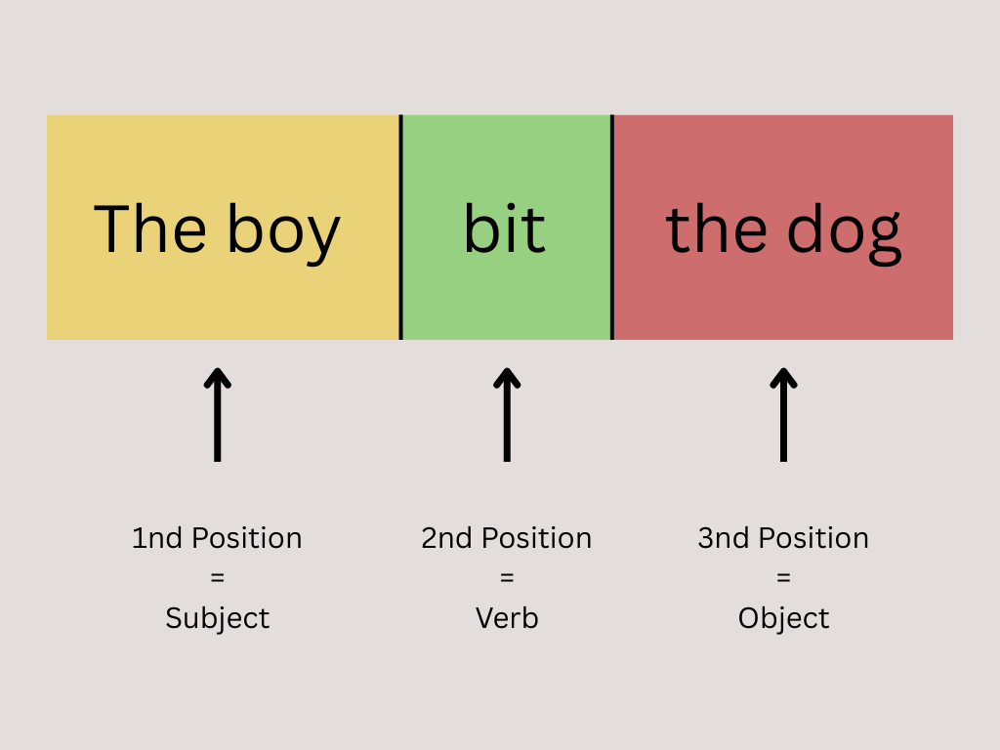
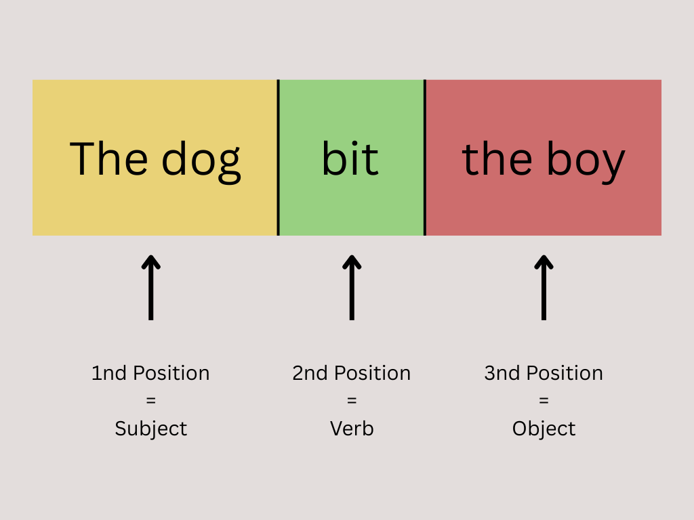
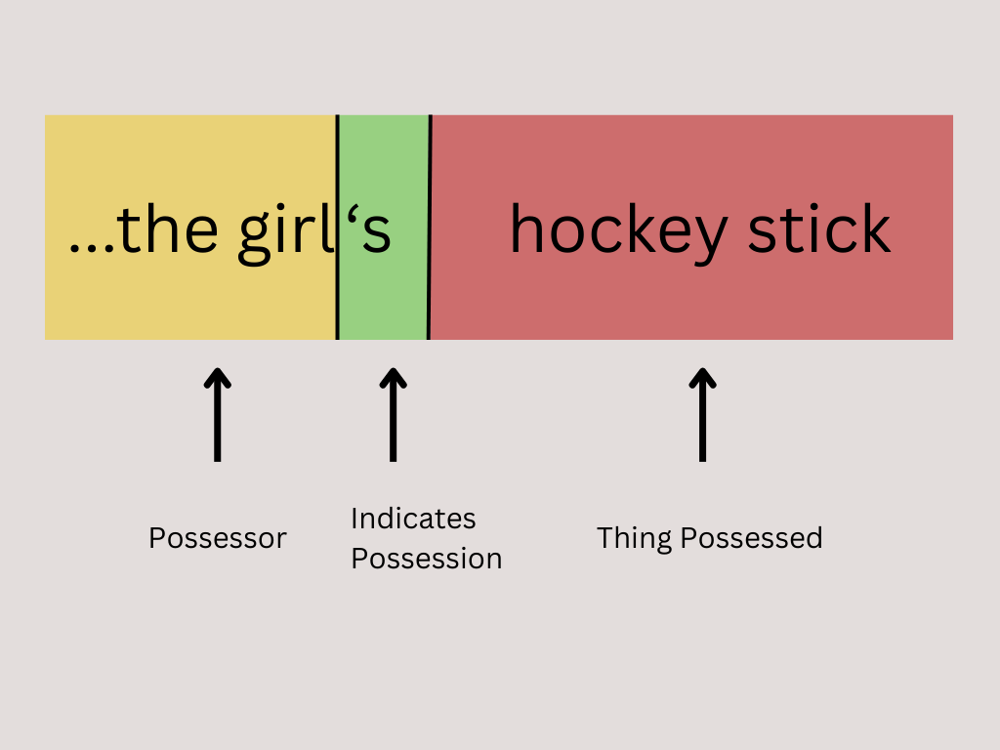
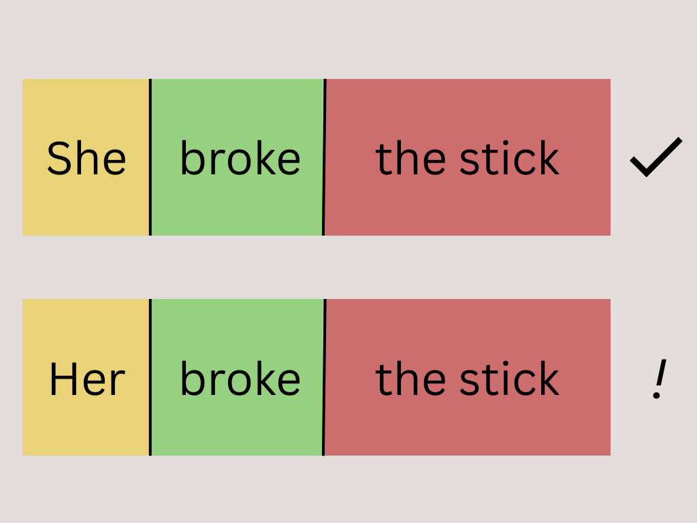
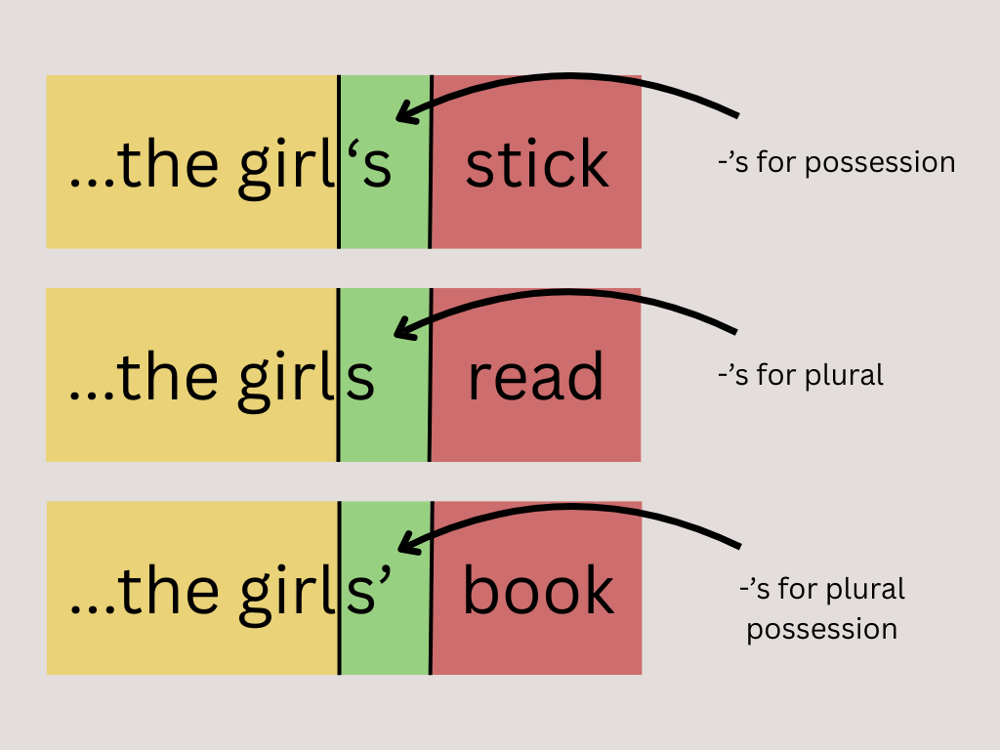
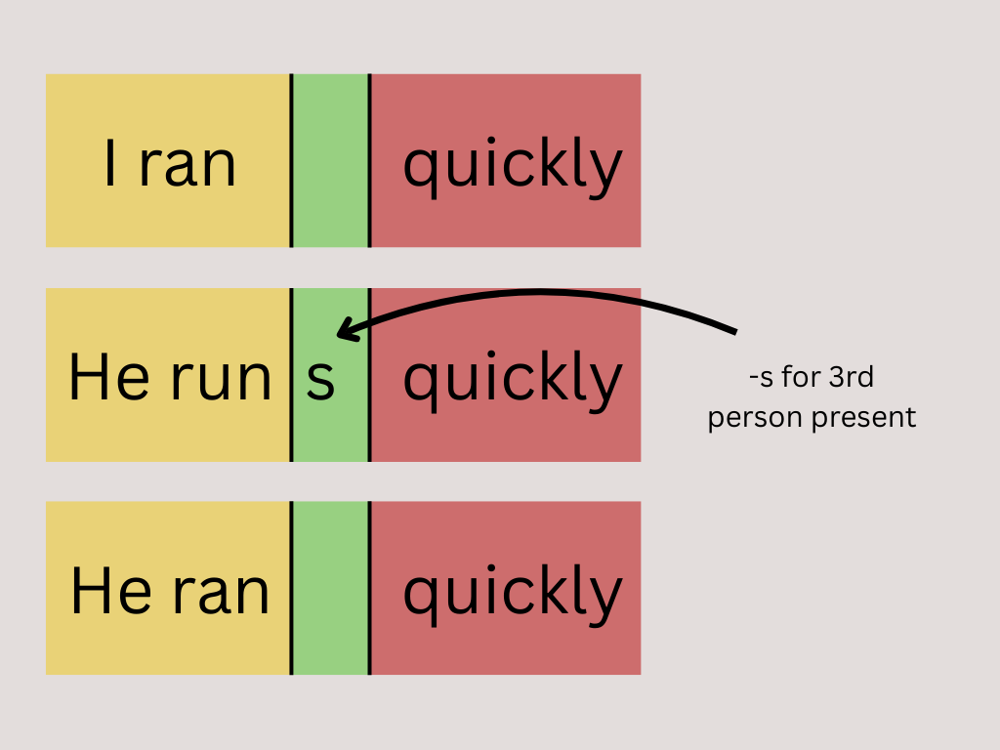
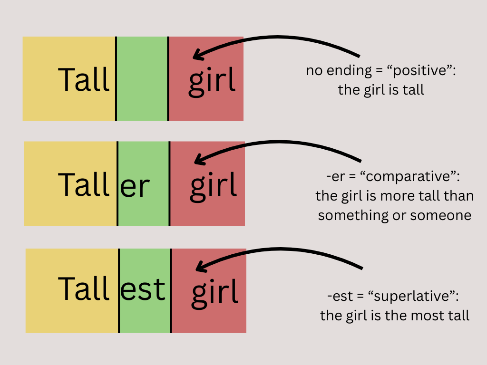
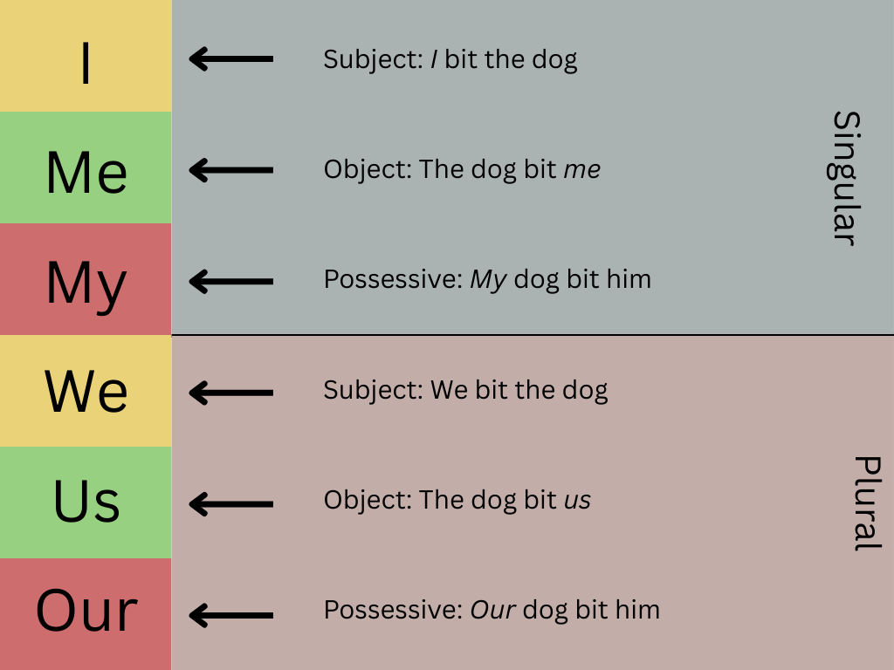

# Inflectional Morphology in English

For the most part, English uses word order to indicate the relationship among words in sentences. When I say “The boy bit the dog”, people listening to me know that it was the boy who did the biting because The boy comes first in the sentence. Likewise, they know that it was the dog that was bitten because the dog comes after bit.

  

> If I reverse the positions of boy and dog the sentence changes meaning as well: now the dog is doing the biting:

  

But not all relationships among words in sentences are indicated by word order. Sometimes we use special forms of a word or add sounds or syllables (known as inflections) as to the end to indicate particular relationships among words¹.

For example, if I say “She broke the girl’s hockey stick”, we know that the hockey stick was owned by the girl because the word girl comes before the hockey stick and has an -’s on it².

  

Likewise, we know that she—whoever she might be—broke the girl’s stick both because the word comes first in the sentence and, more importantly, because the word is she and not some other form like her; in fact, if I replace she with her, but make no other changes, the sentence will not make sense to most speakers of English³:

  

Endings such as -s and changes in form such as between she and her are known broadly as inflections. English now uses very few and relies mostly on word order to express such relationships (other languages and earlier stages of the English language rely much more heavily on inflections than does Modern English).

This tutorial looks at English inflectional morphology. That is to say the grammatical endings used in English.

**Previous: Introduction | Next: Parts of Speech (Word classes)**

---

## The Most Common Inflections

The most common inflection by far in Modern English is -s. This is used with or without an apostrophe to indicate any one of a number of relationships, depending on the type of words involved and the context in which they are found.

On nouns (words like boy and music “the boy” and “good music”), for example, -s is commonly used to indicate

- singular possession  
- plural  
- plural possession

  

  

On verbs (words like run in “he runs quickly”), s is used to indicate that the sentence is taking place in the present and is third person singular (i.e. about something that be described using he, she, or it, rather than I or you).

  

Another inflection used with verbs includes -ed, which is used with some verbs to indicate that the sentence is happening in the past (e.g., “I loved him” compared to “I love him”). Some verbs use changes in form to indicate the same thing (e.g. “They sang well” compared to “They sing well”). Inflections or changes in form can also be used to indicate whether a statement reflects a real or non-real situation (e.g. “She is a police officer; she is nice”, where the situation described is assumed to be real, compared to “Were she a police officer, she would be nice”, where the situation described is not real—i.e. she isn’t a police officer and isn’t nice).

Many adjectives (words like tall in “the tall girl”) use the inflections -er and -est to indicate comparison: “the taller girl” is more tall than “the tall girl” and “the tallest girl” is the most tall of all.

  

The words that show the most complete set of inflections, however, are the pronouns (words like he, them, *her, she, and its*). Here, different forms of the word are used to indicate a number of different types of relationships whether something is the subject or object of a verb (I in “I hit Dave” against me in “Dave hit me”), singular or plural (he against they), or possessive singular against possessive plural (her against their).

  

---

## Paradigms

As the above suggests, inflections found on different types of word can mean different things. The -s on runs in “he runs quickly”, for example, means something different than the -s on girls in “The girls went to the game”. Likewise, similar types of words can sometimes use different inflections or changes to indicate the same type of relationship. While car and church both use -(e)s to indicate plural, for example, child uses -ren (children) and sheep uses nothing at all (“one sheep, ten sheep”). Sometimes, different versions of English can use different forms for the same word. North American and British people, for example, differ in whether you should say “I dove into the water” or “I dived into the water.” Often these differences reflect forms from earlier stages of the language or are the result of changes in the history of the language.

The following tables are known as paradigms. These lay out information about inflections for each type of word.

Because this is an introductory tutorial, I have only presented the most common examples of each type of word. An exercise at the end asks you to come up with some more unusual examples.

---

## Pronoun Inflections

Pronouns are words like I and them that can stand for nouns in sentences (for example: “This is my sister. She is the tallest woman I know,” where she in the second sentence stands for sister in the first sentence). Pronouns have the most detailed inflectional system in English: depending on the specific example, they can show distinctions to indicate whether a word is singular or plural, the subject or object of a sentence, or singular or plural possessive.

The most complete set of pronouns is found in the first person (i.e. I and we) and the third person singular masculine (i.e. he) and plural (i.e. they). The other pronouns all have more overlap or unchanging forms.

| Number | Function in sentence | Form |
|--------|----------------------|------|
| Singular (i.e. one) | Subject | I, you, he, she, it |
| | Object | me, you, him, her, it |
| | Possession | my, your, his, her, its |
| Plural (i.e. more than one) | Subject | we, you, they |
| | Object | us, you, them |
| | Possession | our, your, their |

---

## Noun Inflections

Nouns (words like girl, woman, child, and sheep: a more complete definition is given in the next tutorial) have next most complete system. For most nouns (there are some exceptions), we can distinguish singular against plural and between possession and all other functions. Note how in the noun paradigm, the same form of each noun appears for the subject and the object:

| Number | Function in sentence | Form |
|--------|----------------------|------|
| Singular | Subject or Object | girl, woman, child, sheep |
| | Possession | girl’s, woman‘s, child’s, sheep’s |
| Plural | Subject or Object | girls, women, children, sheep |
| | Possession | girls’, women’s, children’s, sheep’s |

---

## Adjective Inflections

Adjectives (words like blue, quick, or symbolic that can be used to describe nouns) used to have many of the same inflections found on the nouns and pronouns. In Modern English, however, the only inflections that remain are used to indicate degree of comparison and not all adjectives can show even this: while most short adjective can use -er and -est, longer adjectives use more and most before the word in question:

| Degree | Form |
|--------|------|
| Positive | blue, quick, symbolic |
| Comparative | bluer or more blue, quicker, more symbolic |
| Superlative | bluest, quickest, most symbolic |

---

## Verb Conjugations

Verbs are words like [he] loves, [I] think. Inflections on verbs indicate tense (past vs. present: he loves vs. he loved), number (singular vs. plural: he loves vs. they love), and person (first vs. second vs. third: I think vs. you think vs. she thinks or the boy thinks).

Inflections can also be used to distinguish forms of the verb that are used in different kinds of contexts: for example, adding -ing to a verb makes a form that can be used as a noun or an adjective (compare “I fight” against “the fighting ended today” or “the fighting schoolteachers were pulled apart by the principal”). This form can also be used with forms of the verb to be to indicate that the verb is describing something on-going (compare “I walk” with “I am walking” and “I walked” with “I was walking”). This difference is known as aspect.

A similar form can be built using either -ed or -en with a change in the form of the verb (e.g. “loved” and “driven”)⁴. Forms like “loved” or “driven” can be used as adjectives (e.g. “the loved child” and “the driven snow”) or, when combined with forms of to be, to indicate that the subject was the acted upon rather than acting (compare “I drove the team to the game” against “I was driven by the team to the game“—in the first the subject I was in control of the car; in the second, it was in a car controlled by the team). This contrast is known as voice: “I drove the team” is active voice, “I was driven by the team” is passive voice).

*driven* and *loved*, *driving* and *loving* are known as participles. *driven* and *loved* are past participles (because they refer to the past) and *living* and *driving* are present participles because they refer to the present,

The participles, both past and present, are known as non-finite forms of the verb. They are called this because they do not have subjects when they are used in sentences⁵. Non-finite forms can be contrasted, therefore, to finite forms of the verb, such as (I) drive, (we) drove, (Bob and Henry) thought, (Martha) wins. These are finite because they do agree with subjects.

There is one more non-finite form of the verb, the infinitive. This is the “dictionary form” of the verb (i.e. the form you would look under if you wanted to find out what drive means). In English, it appears in two forms, with and without to: “I want to drive” and “I can drive very well, thank you!”.

As the difference between I love : I loved and I drive : I drove shows, most verbs in English can be placed in one of two main categories: verbs that change into the past by adding -ed (like love) and those that change into the past by changing the form of their stem (like drive). These two types of verbs are known as regular verbs (like love) and irregular verbs (like drive)—though it is not really true to say that drive is irregular, as other verbs follow similar patterns:

### Finite Forms

| Tense | Number | Person | Form |
|-------|--------|--------|------|
| Present | Singular | First and Second (I / you) | love, drive |
| | Singular | Third (he / she / it / the woman) | loves, drives |
| | Plural | All (we / you / they / women) | love, drive |
| Past | Singular and Plural | All (I / you /he / she / it / the woman / we / you / they / women) | loved, drove |

### Non-Finite Forms

| Grammatical Form | Tense | Form |
|------------------|-------|------|
| Participle (i.e. can be used as adjective or noun) | Present | loving, driving |
| | Past | loved, driven |
| Infinitive | — | (to) love, (to) drive |

---

## Exercises

The following exercises test you on your ability to apply the above material. The real test of your knowledge of grammar is not whether you are able to memorise terms and definitions, but whether you can supply examples and describe real-life sentences.

1. Give examples of four different inflections in sentences. Make sure you can give show on a verb, one on a noun, one on an adjective, and one on a pronoun.  
2. How many different ways can -s (with or without an apostrophe) be used as an inflection in English? Give one example in a sentence for each.  
3. Give an example in a sentence of a noun that does not use -s to indicate plural  
4. Indicate the third person singular present word or words in the following sentence:  
   *Snow White sees the seven dwarves, but they don’t know that she knows who they are.*  
5. Give an example of an “irregular” verb like drive.  
6. What is the plural of these?  
