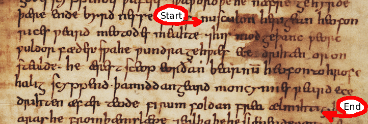

# Old English Metre: A Crash Course

Although the Anglo-Saxons left no accounts of their metrical organisation, statistical and linguistic analysis of the poetic corpus has allowed us to come up with a good idea as to how their verse worked.

Like all early Germanic metres, Old English verse is **accentual and alliterative**. With very few exceptions, end rhyme does not play a structural role. And even when it is found, it never takes the place of **alliteration** (initial rhyme) in the earlier verse.

---

## Stress and Line Division

The basic line consists of **four stressed syllables** and **at least four lesser-stressed syllables** (conventionally described as “unstressed”). A very strong **caesura** (metrical break) is found between stresses two and three. This caesura is so strong that we tend to describe the verse in terms of **half-lines**:

- **a-verse** / **on-verse** (before the caesura)  
- **b-verse** / **off-verse** (after the caesura)

In modern printed editions, on- and off-verses are separated graphically by a gap of three or four spaces, as in this excerpt from *Cædmon’s Hymn* (ed. O’Donnell 2005, adapted from the transcription of Tanner 10 [T1]):

>Nu sculon herigean heofonrices weard,
>meotodes meahte, ond his modgeþanc,
>weorc wuldorfæder— swa he wundra gehwæs,
>ece drihten, or onstealde!

> Now we must honour the guardian of heaven,  
> The might of the measurer, and his thoughts,  
> The work of the father of glory—as he, the eternal lord,  
> Created the beginning of each of wonders!

  

In Anglo-Saxon manuscripts, poetry is written **from margin to margin**, as in the following facsimile and diplomatic transcription from the same manuscript (adapted from O’Donnell 2005)¹. While scribes did not place each half-line on its own line, they often marked **line boundaries** and **caesuras** with a raised point or other punctuation, and there is evidence they were aware of metre as they copied (see O’Brien O’Keeffe 1990; O’Donnell 1996).

> *Detail from Oxford, Bodleian Library, Tanner 10 showing the beginning and end of Cædmon's Hymn. Contrast and colour balance has been artificially enhanced to show detail.*

[ Approx. 28 characters omitted ] Nusculon herıgean heofon|
rıces ƿeard meotodes meahte ⁊hıs 〈mod〉geþanc ƿeorc|
ƿuldor fæder sƿahe ƿundra gehƿæs ee{c}e 〈a{d}〉rih〈t〉en or on|
stealde· he ærest sceop eorðan bearnū heofonto hrofe|
halıg scyppend· þamıddangeard moncynnes ƿeard ece|
drıhten æfter teode fın{r}um foldan frea ælmıhtıg· [ Approx. 3 characters omitted ]

---

## Alliteration

The half-lines are tied together by **alliteration**. The rule:

- One or **both stressed syllables** in the **on-verse** must alliterate with the **first stressed syllable** in the **off-verse**.  
- The **second stressed syllable** in the **off-verse must not** share in the alliteration.

**Standard patterns** (alliterating syllables in **bold**):

- **meotodes meahte,**    ond hıs **mod**geþanc,  
- **weorc wuldor**fæder—    swa he **wund**ra gehwæs,  
- **ece** drıhten    **æ**fter teode

### Consonantal Alliteration

When alliterating syllables begin with a consonant, the **sounds must be identical**. Thus **s** alliterates only with **s**, **b** with **b**, etc. This is also true for certain **s-clusters**:

- **sp** alliterates only with **sp**  
- **st** only with **st**  
- **sc** only with **sc**

**Special cases:** the letters **〈c〉** and **〈g〉** can represent two sounds each in Old English:

- 〈c〉 = /ʧ/ (*ċyric* “church”) or /k/ (*cyning* “king”)  
- 〈g〉 = /j/ (*ġeard* “yard”) or /g/ (*gōd* “good”)²

**In earlier poetry**, poets **do not distinguish** these values for alliteration: any **〈c〉** alliterates with **〈c〉**, and any **〈g〉** with **〈g〉**, regardless of the sound.  
Example (*Beowulf* 2482):

> **heardan cēape;**    **Hæðcynne** wearð  
> “…a hard bargain; to Hæðcyn was…”

Common, too, is alliteration between **/g/** and **/k/**, e.g. *begoten, golde, gimmas* (*Dream of the Rood* 7):

> **begoten** mid **golde;**    **gimmas** stōdon

**In later poetry** (10th c. and after), poets often **do** distinguish (see Amos 1980). In *The Battle of Maldon* 32, **gārrǣs** and **gafole** (both /g/) alliterate, but **forgielden** (/j/) does not³:

> þæt gē þisne **gārrǣs**    mid **gafole** forgielden

### Vocalic Alliteration

All vowels and diphthongs **alliterate with each other** (a, æ, e, i, o, u, y, ea, eo, ie). No distinction is made between long/short or vowel/diphthong. In practice, better poets tended to **avoid like-with-like**; vocalic alliteration often signals the **absence** of consonantal alliteration. *Cædmon’s Hymn* has three examples:

- **ece** drıhten    **or** onstealde⁴  
- **he** ærest sceop    **eor**ðan bearnum  
- **ece** drıhten    **æ**fter teode

---

## Accentual Patterns

Most half-lines belong to a limited number of accentual patterns (metrical **types**) that organise stressed, unstressed, and half-stressed syllables.

### Sievers Types

Eduard Sievers identified five major types (named A–E), with many subtypes:

- **Type A:** `/×/×`  
- **Type B:** `×/×/`  
- **Type C:** `×//×`  
- **Type D:** `//\×`  
- **Type E:** `/\×/`

> In this scansion: `/` = metrically stressed, `×` = metrically “unstressed,” `\` = half-stressed.

Subtypes vary the number/placement of unstressed or half-stressed syllables; **anacrusis** adds extra unstressed syllables before the first stress (esp. in A, D, and perhaps E). **Hypermetric** lines (very long) follow comparable principles (notably in *Dream of the Rood*). See Pope & Fulk 2001, 129–158.

**Mnemonic** (after Bruce Mitchell; updated by Rachel Hanks):

- **Type A** (`/×/×`) — *Anna angry*  
- **Type B** (`×/×/`) — *gave Bob the bold*  
- **Type C** (`×//×`) — *A Clear Kicking,*  
- **Type D** (`//\×`) — *Dire, Death-bringing,*  
- **Type E** (`/\×/`) — *Earth-rending End*

*(It’s a mnemonic: accurate enough to remember the patterns.)*

---

## Syllable Length

Whether a syllable scans as long/short depends on **length**, **word-stress**, and **clause-stress**.

A syllable can be long:

1. **By nature:** contains a **long vowel** (often marked with a macron).  
   - **wīc** “dwelling”; **wēpan** “weep”; **hālig** “holy”
2. **By position:** followed by **two+ consonants** within the word or **one+ at a word boundary**.  
   - **giestas** “strangers”; **eoh** “horse”; **edg** “edge”
3. **By resolution:** a **short stressed** syllable counts as long when followed by an **unaccented syllable** that is not metrically required; mark with a **tie**.

Resolution examples (long by resolution in **bold**, following syllable in *italics*):

- **metud**aes *maecti* (pattern: `/͜××/×`)  
- **ōr** *āstelidæ* (pattern: `/×/͜××`)  
- **heben** *til* hrōfe (pattern: `/͜××/×`)

Resolution is **context-dependent**; some subtypes allow short stressed/unstressed syllables without resolution. Example **without** resolution:

- on **camp**stede (pattern: `×/̮\×`)

---

## Word-Stress

### Primary Stress

Germanic primary stress falls on the **first syllable**. In Old English, this remains largely true for **simple words** and **most compounds**:

- **unnytt** “useless”; **giefu** “gift”; **standan** “to stand”

**Main exceptions** (stressed syllables in **bold**):

- Prefix **ge-** is **never stressed**: ge**hwǣs**, ge**sittan**, ge**sceaft**.  
- Most verb/adverb “prefixes” are unstressed: **wiþ**sacan, **æt**gædere.  
- **for-** and **be-** may be stressed or not on nouns: **for**bod “prohibition” vs. for**wyrd** “ruin” (Campbell 1959/1991, §74).

### Secondary Stress

Secondary stress (shown *italic*) falls:

- on second elements of compounds: *wæls*leaht “slaughter”  
- on “heavy” derivational suffixes after a long or resolved syllable: sciep**pend**, beorh**tost** (Campbell §89)  
- on final syllables lengthened by inflection: Hen**ges**tes (gen. sg.); ōþer**ne** (acc. sg. m.)

---

## Clause-Stress

Not all stressed syllables are equally prominent in context. As in PDE, content words (nouns/adjectives) tend to take higher **sentence stress** than function words (pronouns/conjunctions):

> *Would an **apple** be as **sweet**?*

Out-of-position words receive heavier stress:

> **I** went up the mountain.  
> Up the mountain went **I**.

---

## Stress and Word Classes

Three broad **metrical classes**:

- **Always Stressed:** nouns, adjectives, infinitives, participles  
- **Sometimes Stressed:** finite verbs, adverbs  
- **Rarely Stressed:** conjunctions, prepositions, pronouns, relatives

This reflects a linguistic split: **open classes** (nouns, adjectives, etc.) are regularly stressed; **closed classes** (function words) are rarely stressed; “sometimes” classes mix both.

---

## Scansion of *Cædmon’s Hymn*

A sample scansion using a modified Sievers system (letter + subtype; see Pope & Fulk 2001):

The following is a scansion of *Cædmon’s Hymn* using a modified form of the Sievers system. Letter names followed by a number (e.g. A-3) refer to common subtypes of the main five verse patterns. See Pope and Fulk 2001 for a detailed listing.

| (A-type)               | a-verse                 | b-verse                  | (B-type)             |
|------------------------|-------------------------|--------------------------|----------------------|
| (A-3: ×××/×)           | Nū scylun hergan        | hefaenricaes uard        | (E: /‿×\\×/)        |
| (A-1: /‿××/×)         | metudaes maecti         | end his mōdgidanc        | (B: ××/×/)           |
| (D-2: //(×)\\×)        | uerc uuldụrfadur        | suē hē uundra gihuaes    | (B-2: ××/××/)        |
| (A-1: /×/×)            | ēci dryctin             | ōr āstelidæ              | (A-1: /×/‿××)       |
| (B-1: ×/×/)            | Hē āerist scōp          | eordu barnum             | (A-1: /×/×)          |
| (A-1: /‿××/×)         | heben til hrōfe         | hāleg sceppend           | (A-1: /×/×)          |
| (B-1: ×/×\\)           | thā middungeard         | moncynnæs uard           | (E: /\\×/)           |
| (A-1: /×/×)            | ēci dryctin             | æfter tīadæ              | (A-1: /×/×)          |
| (A-1: /×/×)            | fīrum foldu             | frēa allmectig           | (D-1: //\\×)         |

---

## Other Scansion Systems

Sievers’ system is generally **descriptively adequate** but **theoretically limited**; many alternatives have been proposed. The most widely accepted is the **Stress-Foot** system (Russom), beyond this short introduction.

---

## Further Reading

- Mitchell & Robinson 2001, Appendix C; Pope & Fulk 2001, 129–158 (accessible introductions)  
- Sievers 1885–1887; 1893 (foundational)  
- Bliss 1962/1993 (standard Sievers-based practice)  
- Russom 1987; 1998; Bredehoft 2005 (Stress-Foot and revisions)

---

## Works Cited

- Amos, Ashley Crandell. 1980. *Linguistic Means of Dating Old English Poetrical Texts*. Cambridge, MA: Medieval Academy.  
- Bliss, A. J. 1962/1993. *Introduction to Old English Metre*. Oxford: Blackwell. Repr. in *Old English Newsletter Subsidia* 20.  
- Bredehoft, Thomas A. 2005. *Early English Metre*. Toronto: University of Toronto Press.  
- Campbell, A. 1959/1991. *Old English Grammar*. Oxford: Clarendon.  
- O’Brien O’Keeffe, Catherine. *Visible Song. Transitional Literacy in Old English Verse*. Cambridge Studies in Anglo-Saxon England 4. Cambridge: CUP.  
- O’Donnell, Daniel Paul. 1996. “Manuscript Variation in Multiple-Recension Old English Poetic Texts: The Technical Problem and Poetical Art.” Unpubl. PhD Diss., Yale University. Available online.  
- O’Donnell, Daniel Paul. 2005. *Cædmon’s Hymn: A Multimedia Study, Edition, and Archive*. Cambridge: D. S. Brewer.  
- Pope, John C., and R. D. Fulk. *Eight Old English Poems*. New York: Norton, 2001.  
- Russom, Geoffrey. 1987. *Old English Metre and Linguistic Theory*. Cambridge: CUP.  
- Russom, Geoffrey. 1998. *‘Beowulf’ and Old Germanic Meter*. Cambridge: CUP.  
- Sievers, Eduard. 1885–1887. “Zur Rhythmik der germanischen Alliterationsverses.” *Beiträge zur Geschichte der deutschen Sprache und Literatur* 10:209–314, 451–545; 12:454–482.  
- Sievers, Eduard. 1893. *Altgermanische Metrik*. Halle: Niemeyer.

---

## Notes

[^1]: For the conventions used in this transcription, see O’Donnell 2005, § ii.6.  
[^2]: Many introductory textbooks distinguish these letters with **ċ** for /ʧ/ and **ġ** for /j/, reserving **c** and **g** for /k/ and /g/. These are **modern editorial** signs, not manuscript characters.  
[^3]: If *forgielden* shared in the alliteration, the line would be unmetrical, since the second off-verse stress may **not** alliterate. Even in *Maldon*’s unusual metre, this constraint holds.  
[^4]: *onstealde* does not share in the alliteration because the **accent falls on** *steal*, not on the prefix.  
[^5]: A thorough, accessible discussion of OE word-stress (the basis for this summary) is Campbell 1959/1991, ch. II.
